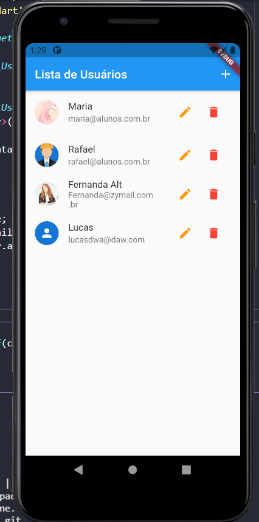
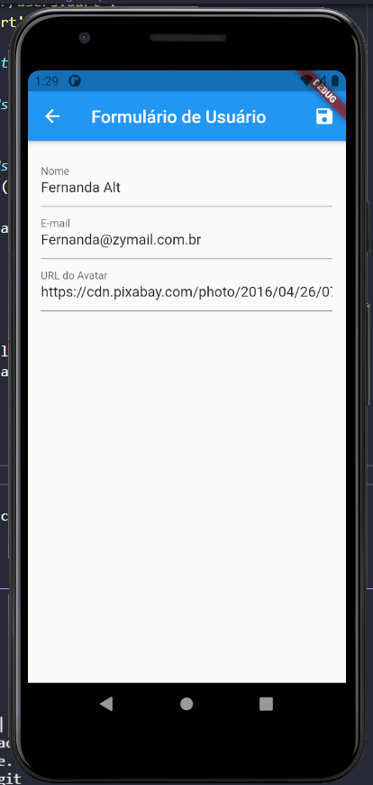

# Flutter CRUD

A simple CRUD in Flutter, to list users.

In this project I have used concepts of Navigator to change route between Home and the User Form responsible for add or edit user. And I practiced a lot of widgets most common used like IconButton, Scaffold, ListView, Form, TextFormField and AlertDialog.
Other amazing point that i studied was the concept of provider.

Follow images of the project:

